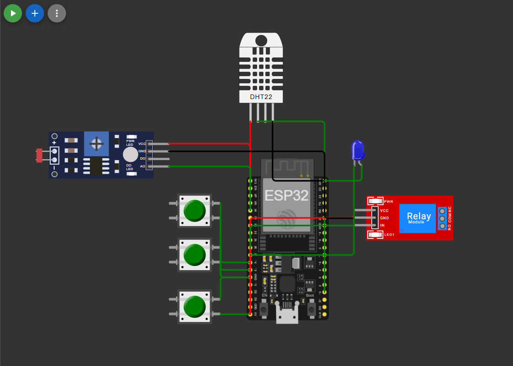

# 🌱 FarmTech Solutions — Sistema de Irrigação Inteligente

## Fase 2 — Coleta de Dados com ESP32

**Aluna:** Ana Flora Lauris  
**Instituição:** FIAP  
**Estado:** São Paulo  
**Culturas trabalhadas:** Soja e Milho

---

## 📋 Descrição do Projeto

A FarmTech Solutions é uma startup de Agricultura Digital. Nesta segunda fase do projeto, foi desenvolvido um sistema de irrigação automatizado e inteligente utilizando um ESP32 simulado na plataforma [Wokwi](https://wokwi.com).

O sistema monitora em tempo real:

- Níveis de nutrientes NPK (Nitrogênio, Fósforo e Potássio) via botões
- pH do solo via sensor LDR
- Umidade via sensor DHT22

Com base nesses dados, o sistema decide automaticamente se deve acionar ou não a bomba de irrigação (representada por um relé).

---

## 🌾 Culturas Agrícolas

As culturas foram escolhidas por serem as principais do estado de São Paulo.

### Soja

| Parâmetro | Valor ideal | Valor no sistema |
|---|---|---|
| pH do solo | 6.0 – 7.0 | Informativo (limitação do Wokwi) |
| Umidade mínima para irrigar | 60% | 60% |
| NPK necessário | N, P e K | Qualquer um detectado |

### Milho

| Parâmetro | Valor ideal | Valor no sistema |
|---|---|---|
| pH do solo | 5.5 – 7.0 | Informativo (limitação do Wokwi) |
| Umidade mínima para irrigar | 55% | 55% |
| NPK necessário | N, P e K | Qualquer um detectado |

---

## 🔌 Componentes do Circuito

| Componente | Função no projeto | Pino ESP32 |
|---|---|---|
| Botão verde (N) | Simula sensor de Nitrogênio | GPIO 13 |
| Botão verde (P) | Simula sensor de Fósforo | GPIO 12 |
| Botão verde (K) | Simula sensor de Potássio | GPIO 14 |
| LDR | Simula sensor de pH do solo | GPIO 34 (analógico) |
| DHT22 | Simula sensor de umidade do solo | GPIO 15 |
| Relé | Simula bomba d'água | GPIO 26 |
| LED azul | Indicador visual da bomba | GPIO 27 |

---

## 🖼️ Circuito no Wokwi



> O circuito foi montado e simulado na plataforma [Wokwi.com](https://wokwi.com).

---

## ⚙️ Lógica de Irrigação

O sistema funciona da seguinte forma:

1. Ao iniciar, o Serial Monitor solicita que o usuário selecione a cultura (`1` para Soja, `2` para Milho)
2. Com a cultura selecionada, o sistema monitora os sensores continuamente a cada 2 segundos
3. A bomba de irrigação é acionada quando **duas condições são verdadeiras simultaneamente**:
   - A umidade do solo está **abaixo do mínimo** da cultura selecionada
   - **Pelo menos um** dos nutrientes NPK está presente (botão pressionado)

```
irrigar = (umidade < umidadeMinima) AND (N OR P OR K)
```

### Justificativa das adaptações para simulação

O sensor de pH (LDR) foi mantido como leitura informativa no Serial Monitor. Durante os testes, o módulo LDR no Wokwi apresentou instabilidade na saída analógica, impossibilitando seu uso confiável na lógica de decisão. Isso é coerente com o próprio enunciado do projeto, que já prevê substituições didáticas dos sensores reais por componentes disponíveis no simulador.

Os botões NPK simulam sensores que na prática retornariam valores contínuos — aqui funcionam como leitura binária (presente/ausente), conforme especificado no enunciado.

### Exportação de dados para análise

O código C/C++ imprime os dados dos sensores em dois formatos no Serial Monitor:

- **Linha legível:** exibe todos os valores formatados para leitura humana
- **Linha CSV:** prefixada com `CSV,` para facilitar a exportação dos dados

```
CSV,Soja,1,0,0,0.0,56.5,SIM
```

Os dados CSV foram copiados manualmente do Serial Monitor e salvos em `sensores_fase2.csv` — abordagem prevista pelo próprio enunciado para integração entre o simulador Wokwi e sistemas externos no plano gratuito.

---

## 💻 Como executar o ESP32 (Wokwi)

1. Acesse [wokwi.com](https://wokwi.com) e importe o projeto
2. Carregue o arquivo `sketch.ino`
3. Inicie a simulação clicando em **Play**
4. No Serial Monitor, digite `1` (Soja) ou `2` (Milho) e clique em **Send**
5. Ajuste a umidade no DHT22 para abaixo do mínimo da cultura
6. Pressione qualquer botão (N, P ou K) — o relé e o LED azul devem acionar

---

## 🌦️ Opcional 1 — Integração com API OpenWeather (Python)

O script `clima_irrigacao.py` integra dados meteorológicos reais da API pública [OpenWeather](https://openweathermap.org) para complementar a decisão de irrigação.

### O que faz:

- Consulta o clima atual da cidade de **Agudos, SP**
- Busca a previsão de chuva para as **próximas 24 horas**
- Decide se a irrigação deve ser **suspensa ou mantida** com base nos dados climáticos
- Imprime os valores prontos para serem copiados no código C/C++ do ESP32

### Lógica de suspensão:

```
suspender = (chuva_atual >= limite) OR (chuva_prevista_24h >= limite) OR (umidade_ar >= umidade_min)
```

Os limites variam por cultura:
- **Soja:** suspende se chuva ≥ 5.0 mm/h ou umidade do ar ≥ 60%
- **Milho:** suspende se chuva ≥ 4.0 mm/h ou umidade do ar ≥ 55%

### Como executar:

```bash
pip install requests
python clima_irrigacao.py
```

### Exemplo de saída:

```
📍 Cidade      : Agudos, BR
🌡️  Temperatura : 23.9 °C
💧 Umidade ar  : 49%
🌧️  Chuva atual : 0.0 mm/h
🔮 Prev. chuva : 0.0 mm (próx. 24h)
Decisão       : ✅ LIGAR IRRIGAÇÃO
Motivo        : sem chuva prevista e umidade baixa
```

---

## 📊 Opcional 2 — Análise Estatística em R

O script `irrigacao_fase2.R` realiza análise estatística dos dados coletados pelo ESP32 e usa os resultados para decidir se deve ligar a bomba de irrigação.

### Fonte dos dados:

O script lê o arquivo `sensores_fase2.csv`, gerado a partir das leituras reais exportadas do Serial Monitor do Wokwi. Caso o arquivo não seja encontrado, o script utiliza dados simulados como fallback, exibindo um aviso no console.

### O que faz:

- Calcula **média, desvio padrão, mínimo e máximo** de umidade e pH
- Calcula a **frequência de detecção** de cada nutriente (N, P, K)
- Analisa a **tendência recente** de umidade (últimas 5 leituras)
- Decide irrigar com base em estatística:

```
irrigar = (umidade_recente < umidade_min) AND (NPK presente em >= 50% das leituras)
```

- Gera **dois gráficos** com as leituras ao longo do tempo, incluindo linhas de referência por cultura

### Como executar:

1. Coloque `sensores_fase2.csv` na mesma pasta do script
2. Abra o RStudio e execute `irrigacao_fase2.R`

---

## 🔗 Conexão com a Fase 1

Este projeto é a continuação direta da Fase 1, onde foram desenvolvidos:

- Aplicação Python com cadastro de culturas (Soja e Milho), cálculo de área plantada e manejo de insumos
- Análise estatística em R com média e desvio padrão dos dados coletados

As mesmas culturas — **Soja** e **Milho**, principais do estado de São Paulo — foram utilizadas como base para definir os parâmetros de irrigação desta fase.

> 📺 Vídeo de demonstração da Fase 1: https://youtu.be/eqO-80eAe9I

---

## 📁 Estrutura do Repositório

```
FarmTech/
├── fase1/
│   ├── farmtech.py        # Aplicação Python - Fase 1
│   ├── farmtech.R         # Análise estatística em R - Fase 1
│   └── clima.R            # Integração API meteorológica em R - Fase 1
├── fase2/
│   ├── sketch.ino         # Código C/C++ do ESP32
│   ├── clima_irrigacao.py # Opcional 1: API OpenWeather
│   ├── irrigacao_fase2.R  # Opcional 2: Análise estatística em R
│   ├── sensores_fase2.csv # Dados reais exportados do ESP32
│   ├── circuito_wokwi.png # Print do circuito no Wokwi
│   ├── diagram.json       # Diagrama do circuito Wokwi
│   ├── libraries.txt      # Bibliotecas utilizadas
│   └── wokwi-project.txt  # Configuração do projeto Wokwi
└── README.md
```

---

## 📚 Tecnologias Utilizadas

- **ESP32** — microcontrolador principal
- **C/C++ (Arduino)** — linguagem do firmware
- **Wokwi** — plataforma de simulação de circuitos
- **Python** — integração com API climática (Opcional 1)
- **R** — análise estatística e decisão de irrigação (Opcional 2)
- **OpenWeather API** — dados meteorológicos em tempo real

---

## 🎥 Vídeo de Demonstração

> 📺 Link do vídeo no YouTube: https://youtu.be/7v9hhISfAHg

O vídeo demonstra o funcionamento completo do sistema: seleção de cultura, variação de umidade, acionamento dos botões NPK, resposta do relé, integração com API OpenWeather e análise estatística em R com dados reais do ESP32.
