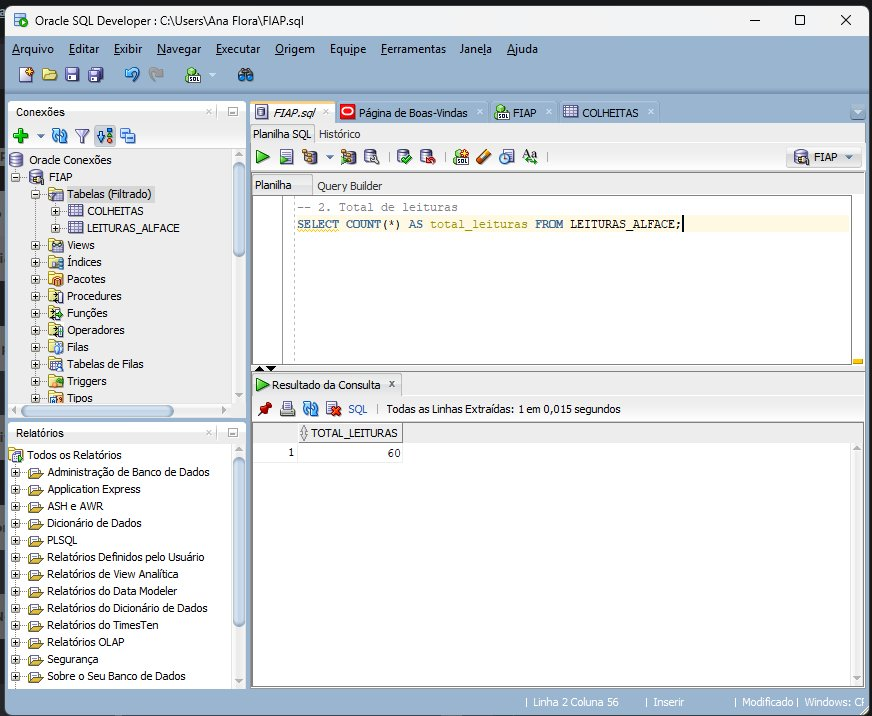
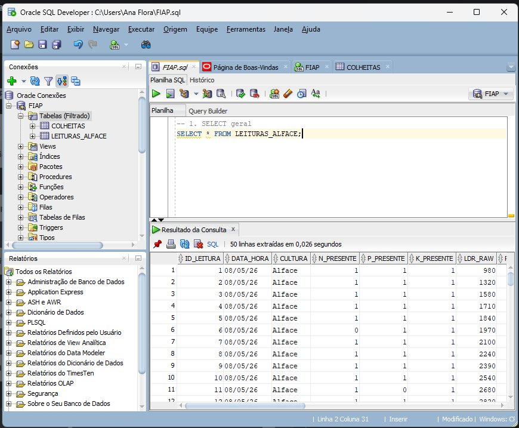
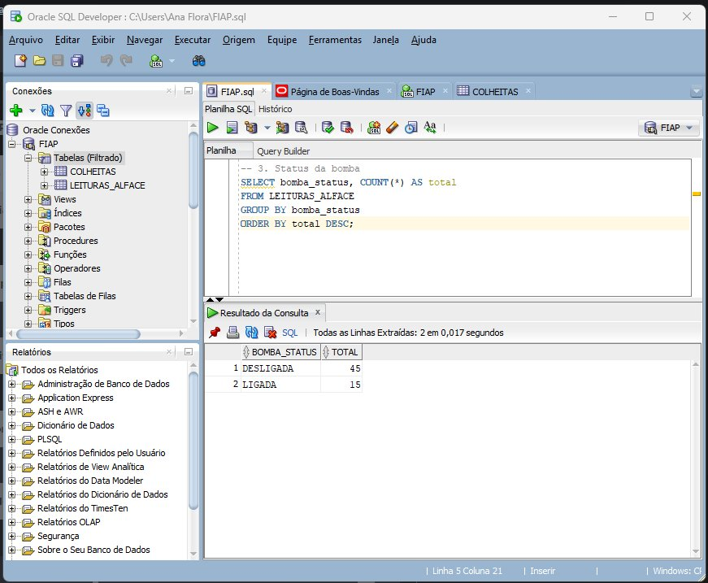
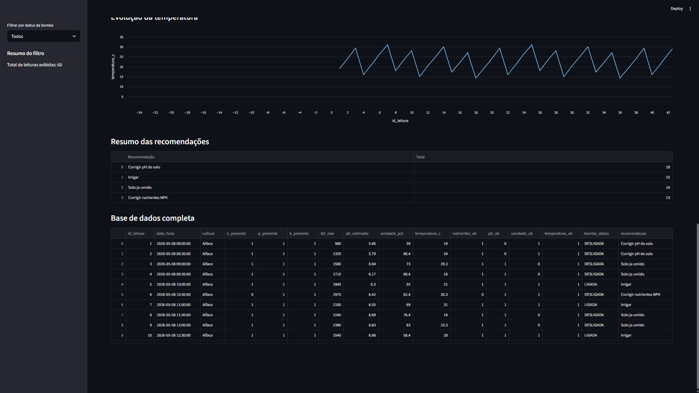
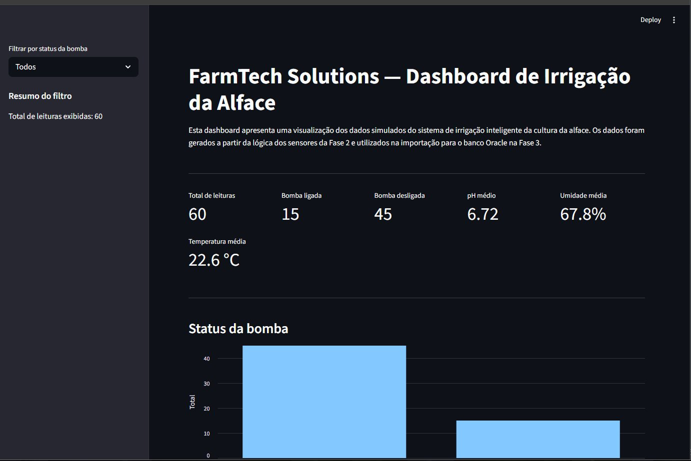
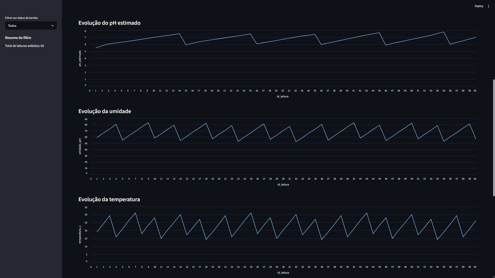

# 🌱 FarmTech Solutions — Fase 3: Banco de Dados Estruturado

## Grupo

| Nome | RM |
|---|---|
| Ana Flora Lauris | RM572202 |
| Clarice Oliveira Barreto | RM571269 |
| Lucas Henrique A. G. de Mello | RM569583 |
| Kevin de Freitas Minervino | RM570667 |
| Renan Chaves Bezerra | RM573532 |

**Instituição:** FIAP  
**Curso:** Inteligência Artificial  
**Cultura trabalhada:** Alface

---

## 📋 Descrição do Projeto

Nesta fase, os dados coletados pelos sensores do sistema de irrigação inteligente desenvolvido na Fase 2 foram carregados em um banco de dados relacional Oracle. O sistema permite armazenar, consultar e analisar as leituras dos sensores de forma estruturada.

Além da entrega obrigatória, o grupo desenvolveu dois opcionais do Programa Ir Além:
- **Opcional 1:** Dashboard interativa em Python (Streamlit)
- **Opcional 2:** Machine Learning aplicado ao agronegócio

---

## 🗄️ Entrega Obrigatória — Banco de Dados Oracle

### Conexão com o banco

A conexão foi estabelecida no Oracle SQL Developer com as seguintes configurações:

| Campo | Valor |
|---|---|
| Host | oracle.fiap.com.br |
| Porta | 1521 |
| SID | ORCL |
| Usuário | RM572202 |

### Tabela importada

A tabela `LEITURAS_ALFACE` foi criada a partir do arquivo `leituras_irrigacao_alface.csv`, contendo 60 leituras dos sensores com as seguintes colunas:

| Coluna | Tipo | Descrição |
|---|---|---|
| ID_LEITURA | NUMBER | Identificador da leitura |
| DATA_HORA | VARCHAR2 | Data e hora da leitura |
| CULTURA | VARCHAR2 | Cultura monitorada |
| N_PRESENTE | NUMBER | Nitrogênio presente (0/1) |
| P_PRESENTE | NUMBER | Fósforo presente (0/1) |
| K_PRESENTE | NUMBER | Potássio presente (0/1) |
| LDR_RAW | NUMBER | Valor bruto do sensor LDR |
| PH_ESTIMADO | NUMBER | pH estimado do solo |
| UMIDADE_PCT | NUMBER | Umidade do solo (%) |
| TEMPERATURA_C | NUMBER | Temperatura (°C) |
| NUTRIENTES_OK | NUMBER | NPK adequado (0/1) |
| PH_OK | NUMBER | pH adequado (0/1) |
| UMIDADE_OK | NUMBER | Umidade adequada (0/1) |
| TEMPERATURA_OK | NUMBER | Temperatura adequada (0/1) |
| BOMBA_STATUS | VARCHAR2 | Status da bomba (LIGADA/DESLIGADA) |
| RECOMENDACAO | VARCHAR2 | Recomendação agronômica |

### Prints do banco

#### Criação e importação da tabela


#### SELECT geral


### Consultas SQL

#### 1. SELECT geral
```sql
SELECT * FROM LEITURAS_ALFACE;
```


#### 2. Total de leituras
```sql
SELECT COUNT(*) AS total_leituras FROM LEITURAS_ALFACE;
```
**Resultado:** 60 leituras


#### 3. Status da bomba
```sql
SELECT bomba_status, COUNT(*) AS total
FROM LEITURAS_ALFACE
GROUP BY bomba_status
ORDER BY total DESC;
```
**Resultado:** DESLIGADA: 45 | LIGADA: 15


#### 4. Médias dos sensores
```sql
SELECT
    ROUND(AVG(ph_estimado), 2) AS ph_medio,
    ROUND(AVG(umidade_pct), 2) AS umidade_media,
    ROUND(AVG(temperatura_c), 2) AS temperatura_media
FROM LEITURAS_ALFACE;
```
**Resultado:** pH médio: 6.47 | Umidade média: 78.33% | Temperatura média: 22.6°C


#### 5. Leituras com bomba ligada
```sql
SELECT id_leitura, data_hora, ph_estimado, umidade_pct, temperatura_c, bomba_status, recomendacao
FROM LEITURAS_ALFACE
WHERE bomba_status = 'LIGADA'
ORDER BY id_leitura;
```

#### 6. Casos em que NPK impediu irrigação
```sql
SELECT id_leitura, data_hora, n_presente, p_presente, k_presente, recomendacao
FROM LEITURAS_ALFACE
WHERE nutrientes_ok = 0
ORDER BY id_leitura;
```

#### 7. pH fora da faixa ideal
```sql
SELECT id_leitura, data_hora, ldr_raw, ph_estimado, recomendacao
FROM LEITURAS_ALFACE
WHERE ph_ok = 0
ORDER BY ph_estimado;
```

#### 8. Resumo por recomendação
```sql
SELECT recomendacao, COUNT(*) AS total
FROM LEITURAS_ALFACE
GROUP BY recomendacao
ORDER BY total DESC;
```


---

## 📊 Opcional 1 — Dashboard em Python (Streamlit)

A dashboard foi desenvolvida com **Streamlit** e visualiza os dados da tabela `LEITURAS_ALFACE` de forma interativa.

### Funcionalidades

- Filtro lateral por status da bomba (LIGADA/DESLIGADA)
- Métricas: total de leituras, bomba ligada/desligada, pH médio, umidade média, temperatura média
- Gráfico de barras do status da bomba
- Gráficos de linha da evolução do pH, umidade e temperatura
- Tabela de recomendações agronômicas
- Tabela completa dos dados

### Como executar

```bash
pip install streamlit pandas
& "C:\Users\<usuario>\AppData\Local\Python\bin\python.exe" -m streamlit run dashboard/dashboard_alface.py
```

### Prints da dashboard




---

## 🤖 Opcional 2 — Machine Learning no Agronegócio

O notebook `AnaFlora_RM572202_fase3_cap1.ipynb` implementa análise exploratória e modelos preditivos usando o dataset `produtos_agricolas.csv` com 2200 amostras de 22 culturas.

### Dataset

| Variável | Descrição |
|---|---|
| N, P, K | Níveis de nutrientes do solo |
| temperature | Temperatura (°C) |
| humidity | Umidade (%) |
| ph | pH do solo |
| rainfall | Precipitação (mm) |
| label | Cultura (22 classes) |

### Análise Exploratória (6 gráficos)

1. Distribuição das 22 culturas
2. Distribuição do pH do solo
3. Distribuição da umidade
4. Boxplot de Nitrogênio por cultura (Top 5)
5. Mapa de correlação entre variáveis
6. Temperatura média por cultura

### Perfil Ideal das Culturas Escolhidas

| Variável | Rice | Maize | Coffee |
|---|---|---|---|
| N | 79.89 | 77.76 | 101.20 |
| P | 47.58 | 48.44 | 28.74 |
| K | 39.87 | 19.79 | 29.94 |
| Temperatura (°C) | 23.69 | 22.39 | 25.54 |
| Umidade (%) | 82.27 | 65.09 | 58.87 |
| pH | 6.43 | 6.25 | 6.79 |
| Chuva (mm) | 236.18 | 610.30 | 158.07 |

### Modelos Preditivos

| Modelo | Acurácia |
|---|---|
| Decision Tree | 97.95% |
| **Random Forest** | **99.32% 🏆** |
| Gradient Boosting | 97.95% |
| KNN | 95.00% |
| Naive Bayes | 99.09% |

**Melhor modelo:** Random Forest com **99.32%** de acurácia

### Como executar

Abra o notebook `AnaFlora_RM572202_fase3_cap1.ipynb` no Google Colab e execute as células em ordem, fazendo upload do arquivo `produtos_agricolas.csv` quando solicitado.

---

## 📁 Estrutura do Repositório

```
fase3/
├── AnaFlora_RM572202_fase3_cap1.ipynb  # Notebook ML
├── dashboard/
│   └── dashboard_alface.py             # Dashboard Streamlit
├── data/
│   └── leituras_irrigacao_alface.csv   # Dados dos sensores
├── sql/
│   ├── 01_criar_tabela.sql             # Script de criação
│   ├── 02_consultas.sql                # Consultas SQL
│   └── 03_insert_exemplo.sql           # Inserção de exemplo
├── docs/
│   └── img/                            # Prints do banco e dashboard
└── README.md
```

---

## 🎥 Vídeo de Demonstração

📺 https://youtu.be/BVf0XI6rni0

O vídeo demonstra o funcionamento completo do projeto: banco de dados Oracle com importação e consultas SQL, dashboard Streamlit interativa e notebook de Machine Learning no Google Colab.

---

## 🔗 Conexão com Fases Anteriores

- **Fase 1:** Aplicação Python com cálculo de área e manejo de insumos para Soja e Milho
- **Fase 2:** Sistema IoT com ESP32 coletando dados de sensores (NPK, pH, umidade)
- **Fase 3:** Dados dos sensores carregados no Oracle + Dashboard + Machine Learning
